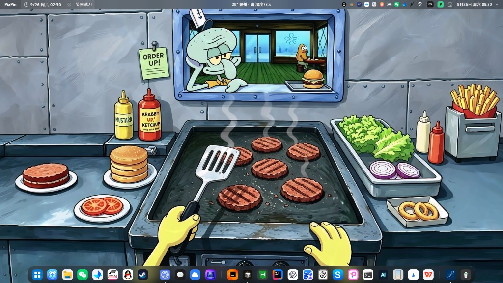
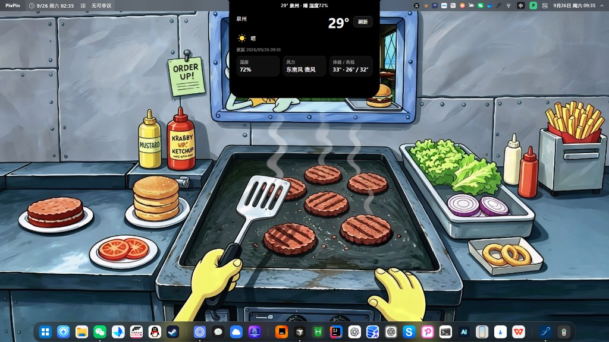
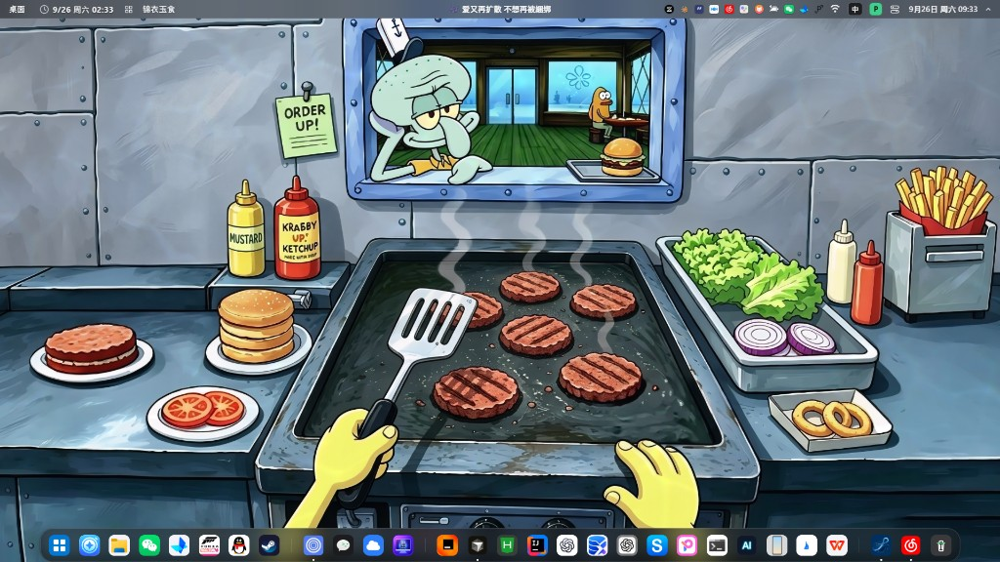
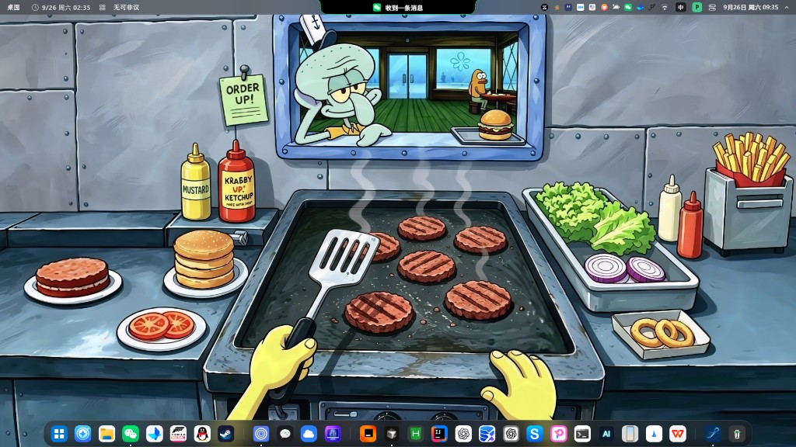
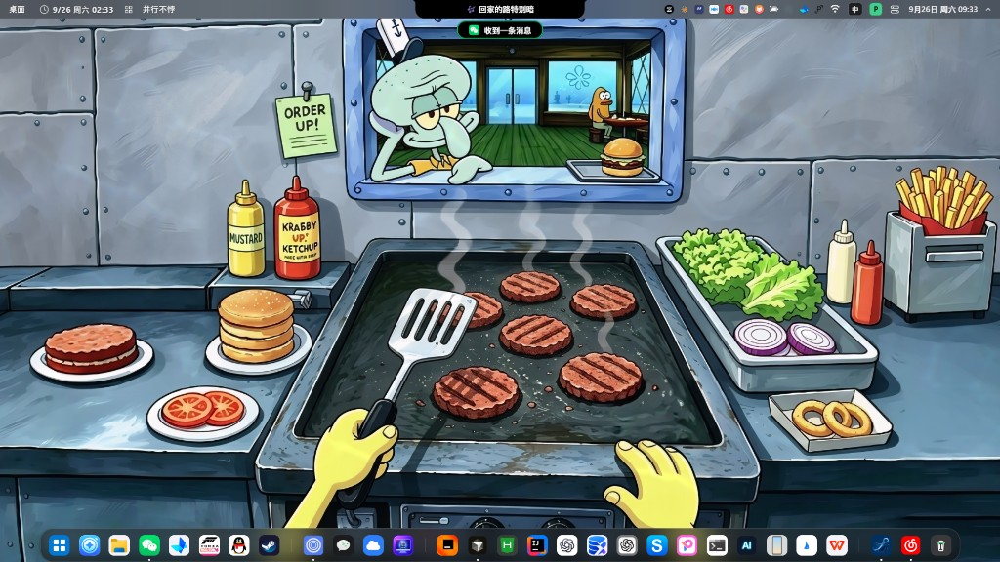
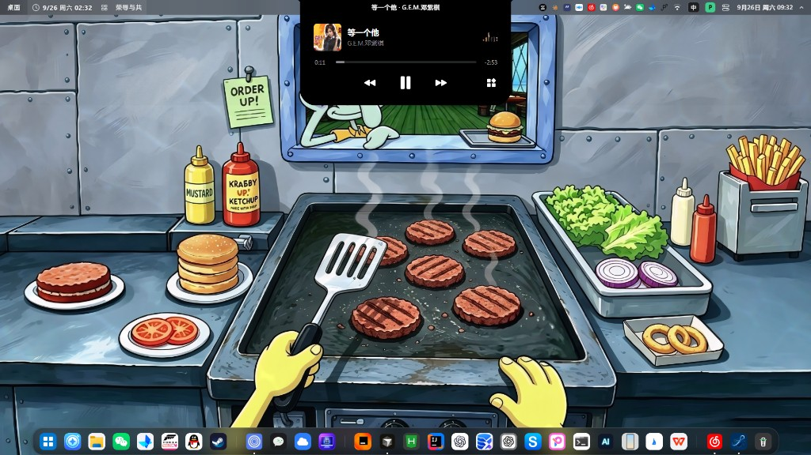
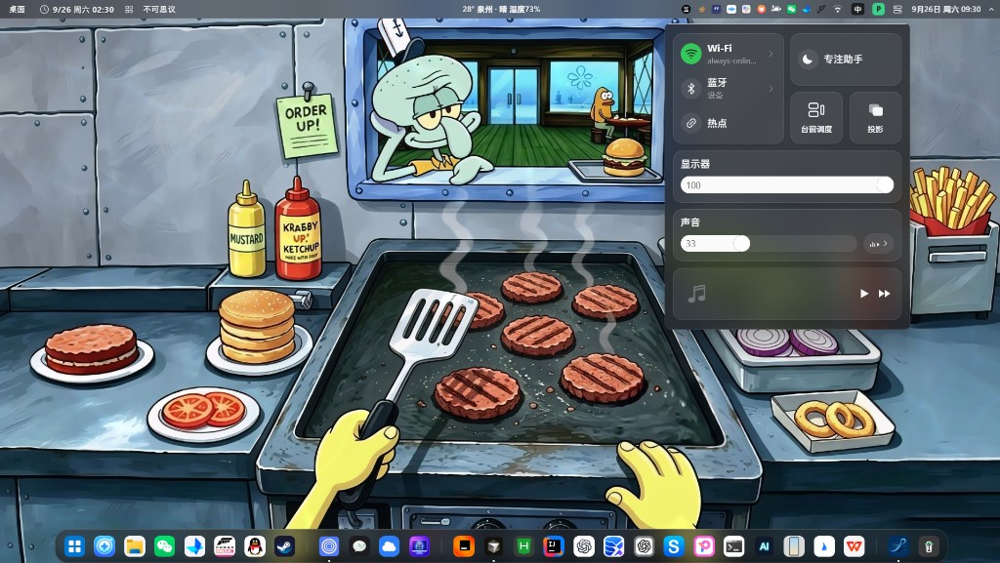
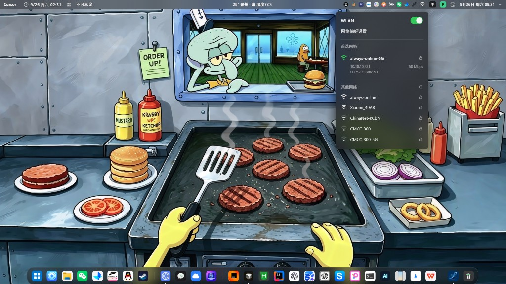
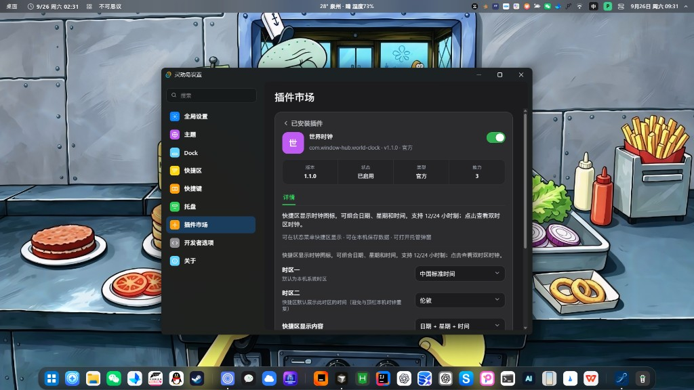

# Window Hub

**Windows 顶栏壳** — 灵动岛、Dock 与系统 chrome，把日常窗口与快捷操作收进一层贴合桌面的宿主。

> Windows 10+ · v0.2 · [Tauri 2](https://tauri.app/) + React 19 + Rust / Win32  
> [English](#english)

## 这是什么

Window Hub 不是启动器或壁纸工具，而是 **Windows 桌面壳**：

| 表面 | 做什么 |
|------|--------|
| **顶栏** | 左侧快捷区（插件条）· 中间灵动岛 · 右侧托盘与系统指示器 |
| **Dock** | 底部应用坞：显示模式、磁化放大、图标编辑、悬停预览 |
| **系统面板** | 控制中心、WLAN / 以太网、输入法菜单 |
| **插件** | 静态包（`.whpx`）+ CapGate（`hub.*`）；设置内本地安装 / 导入示例 |

窗口最大化时停在工作区边缘（AppBar 占位）；游戏与浏览器 F11 / 网页全屏时壳层会按策略隐藏。

## 界面一览

顶栏三段 + 底部 Dock：左侧快捷区（前台应用 / 世界时钟等插件）、中间灵动岛、右侧托盘与系统指示器。

### 总览

<p align="center">
  
</p>

| 区域 | 展示内容 |
|------|----------|
| 左侧快捷区 | 前台应用名、世界时钟、窗口组等插件条 |
| 中间灵动岛 | 天气摘要、媒体歌词、通知横幅等情景占位 |
| 右侧托盘 | 常显图标、WLAN / 电池 / 音量、输入法「中」、系统时钟 |
| 底部 Dock | 应用图标坞（分组、磁化放大、垃圾桶等） |

### 灵动岛

| 天气面板 | 媒体摘要 |
|:--------:|:--------:|
|  |  |
| 点击天气摘要展开详情（温度、湿度、风力） | 播放中时岛栏显示歌词 / 曲目摘要 |

| 消息通知 | 媒体 + 通知共存 |
|:--------:|:--------------:|
|  |  |
| 通知横幅：「收到一条消息」等 Attention 槽位 | 媒体胶囊与绿色消息气泡可同时出现 |

<p align="center">
  
  <br />
  <sub>正在播放：封面、进度与播放控制（插件弹窗）</sub>
</p>

### 右侧系统面板

| 控制中心 | WLAN |
|:--------:|:----:|
|  |  |
| Wi‑Fi / 蓝牙 / 热点、专注助手、亮度与音量、媒体快捷控制 | 开关、已连网络详情、扫描列表与偏好设置入口 |

### Dock 与设置

<p align="center">
  
  <br />
  <sub>设置窗：全局 / 主题 / Dock / 快捷区 / 托盘 / 插件市场（如世界时钟双时区）</sub>
</p>

Dock 常驻底部（可配置显示模式），图标按使用习惯分组；与顶栏 AppBar 一起占位工作区，普通最大化窗口不会盖住壳层。

## 功能概览

| 能力 | 说明 |
|------|------|
| 灵动岛 | 折叠摘要、下拉面板、拖放中转、通知槽位；可选「自动沉浸」闲置透底 |
| Dock | 多种显示模式、热键呼出、图标编辑与悬停预览 |
| 控制中心 | Wi‑Fi / 蓝牙 / 热点、亮度与音量、媒体快捷入口 |
| 网络 | WLAN 扫描与连接；**有线优先**（插网线显示以太网） |
| 输入法 | 语言 / IME 芯片与切换菜单 |
| 托盘 | 原生钩子、常显钉选、闪烁可上岛通知 |
| 主题 | 玻璃材质、最大化窗口吸色（ambient） |
| 插件 | 快捷区 / 岛面板 / 托管弹窗；设置内本地安装 `.whpx` 或导入示例（非远程商店） |

内置 / 可导入示例：天气、世界时钟、正在播放、中转站、文件搜索、窗口组、应用库、系统监控、成语、镜子、Excalidraw 等（见 `docs/plugins/examples/`）。

## 技术栈

- **前端**：Tauri 2 · Vite 7 · React 19 · TypeScript
- **宿主**：Rust · SQLite · Win32（AppBar、Dock、托盘 hook、WLAN、IME、捕获、玻璃材质）
- **分发**：NSIS 安装包

## 环境要求

- Windows 10 或更高
- [Rust](https://rustup.rs/)（MSVC toolchain）
- [Node.js](https://nodejs.org/) + npm
- WebView2（Win10/11 通常已预装）

## 快速开始

```bash
npm install
npm run tauri -- dev
```

| 命令 | 作用 |
|------|------|
| `npm run tauri -- dev` | 开发调试 |
| `npm run tauri:build:fast` | 快速 release（不打安装包） |
| `npm run tauri:build:bundle` | 打 NSIS 安装包 |
| `npm run check` | 架构边界 + 行为测试 + 前端构建 |
| `npm run plugins:check -- <目录名>` | 检查单个插件包 |
| `npm run clean:target` | 清理 Rust `target` |

产物：

- 可执行文件：`src-tauri/target/release/window-hub.exe`
- 安装包：`src-tauri/target/release/bundle/nsis/Window Hub_*_x64-setup.exe`

## 插件开发

| 文档 | 内容 |
|------|------|
| [docs/plugins/README.md](docs/plugins/README.md) | 规范总览 |
| [docs/plugins/development.md](docs/plugins/development.md) | 插件任务边界与工作流 |
| [docs/plugins/host-api.md](docs/plugins/host-api.md) | CapGate 与 `hub.*` |
| [docs/plugins/sdk.md](docs/plugins/sdk.md) | 分表面 SDK |
| [docs/plugins/plugin.schema.json](docs/plugins/plugin.schema.json) | `plugin.json` Schema |
| `docs/plugins/examples/` | 官方示例源 |

原则：**插件 = 静态包**；只使用宿主已声明的 capability；能力不足写在插件文档里，不要为做插件去改宿主。

## 项目结构

AI / 贡献者先读 [AGENTS.md](AGENTS.md)：[插件任务](docs/plugins/development.md)只改指定插件目录；[宿主任务](docs/development/README.md)按模块地图改系统。

```
window-hub/
├── src/                    # React 前端（岛、Dock、托盘、设置、弹窗）
├── src-tauri/              # Rust / Win32 宿主
│   └── resources/plugins/  # 内置插件运行包
├── plugins/                # 需编译的插件作者源（如 file-search）
├── scripts/                # build / checks / maintenance
├── tests/                  # 自动化验证
├── docs/development/       # 宿主开发入口与模块地图
├── docs/plugins/           # 插件契约与示例
├── docs/media/             # README 界面截图
├── docs/archive/           # 历史资料（非当前指令）
├── workspace/              # 本地日志与临时截图（不提交）
└── .cursor/skills/         # 岛 / Dock / 插件等开发细则
```

## 贡献

文件归属见 [工作区约定](docs/development/workspace.md)。改动前请对照相关 `.cursor/skills/`，保持岛栏几何、强调色与插件表面一致。

反馈请尽量附带：Windows 版本、复现步骤、日志或录屏。

## 许可

根目录 **尚未添加 `LICENSE`**。使用、分发或二次开发前请先与维护者确认；第三方组件以其各自许可证为准。

---

## English

**Window Hub** is a Windows-only desktop shell: Dynamic Island, Dock, and system chrome (tray, WLAN/Ethernet, IME, Control Center), plus local static plugins (`.whpx` / CapGate).

Screenshots: see **界面一览** above / [`docs/media/`](docs/media/).

### Highlights

- Island — compact bar, panels, staging, notifications, optional auto-immerse
- Dock — display modes, magnification, icon editor, hover previews
- Chrome — shortcuts strip, tray hooks, wired-preferred network, IME, Control Center
- Plugins — local install / import examples (not a remote store yet)

### Develop

```bash
npm install
npm run tauri -- dev
npm run check
npm run tauri:build:bundle   # NSIS
```

Requires Windows 10+, Rust (MSVC), Node.js, and WebView2.

### License

No root `LICENSE` yet — confirm with maintainers before redistribution.
